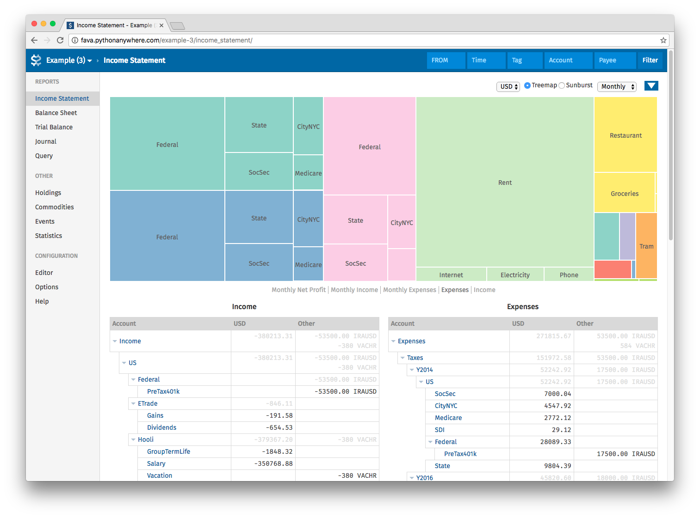
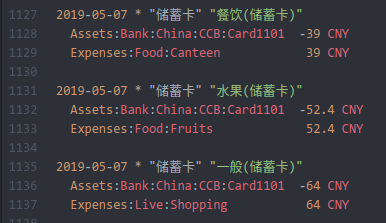

## Beancount 安装

```
# 首先安装 beancount
pip install beancount
# 然后安装 fava
pip install fava
```

Fava 是复式簿记软件 Beancount 的 Web 界面，侧重于功能和可用性，使用非常友好。

<!-- truncate -->

我们可以先使用 `bean-exampl` 生成一个 `Beancount` 文件，文件的后缀名可以自己定义，一般用`.bean`或`.beancount`：

```
(base) XX@XX:~$ mkdir MyBean
(base) XX@XX:~$ cd MyBean/
(base) XX@XX:~/MyBean$ ls
(base) XX@XX:~/MyBean$ bean-example > example.bean
INFO    : Generating Salary Employment Income
INFO    : Generating Expenses from Banking Accounts
INFO    : Generating Regular Expenses via Credit Card
INFO    : Generating Credit Card Expenses for Trips
INFO    : Generating Credit Card Payment Entries
INFO    : Generating Tax Filings and Payments
INFO    : Generating Opening of Banking Accounts
INFO    : Generating Transfers to Investment Account
INFO    : Generating Prices
INFO    : Generating Employer Match Contribution
INFO    : Generating Retirement Investments
INFO    : Generating Taxes Investments
INFO    : Generating Expense Accounts
INFO    : Generating Equity Accounts
INFO    : Generating Balance Checks
INFO    : Outputting and Formatting Entries
INFO    : Contextualizing to Realistic Names
INFO    : Writing contents
INFO    : Validating Results
(base) XX@XX:~/MyBean$ ls
example.bean
```

运行 Beancount:
```
(base) XX@XX:~/MyBean$ fava example.bean
Running Fava on http://localhost:5000
```

在浏览器上打开 http://localhost:5000 ，就可以看到运行界面，如下：

<!--  -->

*Beancount 运行界面*

## example.bean 文件分析

复式记账的最基本的特点就是以账户为核心，Beancount的系统整体上就是围绕账户来实现的。之前提到的会计恒等式中有资产、负债和权益三大部分，现在我们再增加两个类别，分别是收入和支出。Beancount系统中预定义了五个分类：

- Assets 资产
- Liabilities 负债
- Equity 权益（净资产）
- Expenses 支出
- Income 收入

### 表头信息

```
;; -*- mode: org; mode: beancount; -*-
;; Birth: 1980-05-12
;; Dates: 2017-01-01 - 2019-07-12
;; THIS FILE HAS BEEN AUTO-GENERATED.
* Options

option "title" "Example Beancount file"
option "operating_currency" "USD"
```

Beancount 文件中注释使用`;`作为标记。

这里定义了项目的名词：`Example Beancount file`，和使用的货币种类：美元 `USD`。我们如果想使用人民币，可以同时添加 `CNY`，例如：

```
option "operating_currency" "CNY"
```

### Assets 资产

顾名思义，**Asserts** 就相当于我们的存放 **资产的账户**，如果启用一个账户就使用 `open` 命令。

第一列是账户启用时间，第二列是命令，第三列是资产（Assets）名，最后一列是使用的货币种类。

```
* Assets

1990-09-04 open Assets:Cash:CNY CNY                    ; 人民币现金账户
1990-09-04 open Assets:Cash:USD USD                    ; 美元现金账户

1990-09-04 open Assets:Bank:China:CCB:CardXXX1 CNY     ; 银行账户
1990-09-04 open Assets:Bank:China:CCB:CardXXX8 CNY     ; 银行账户

1990-09-04 open Assets:Account:China:Alipay CNY        ; 支付宝账户
1990-09-04 open Assets:Account:China:WeChat CNY        ; 微信账户

1990-09-04 open Assets:Stock:China:GTJA2818 CNY        ; 股票账户

```

我的命名规则是：资产：账户类型：国别：（银行缩写：银行卡号）/（账户名）


### Income 收入

这里定义我们的 **收入来源**，同样如果启用一个收入来源就使用 `open` 命令。

第一列是启用时间，第二列是命令，第三列是收入来源，最后一列是使用的货币种类。

```
* Income

1990-09-04 open Income:China:XXXCompany:Salary              CNY
1990-09-04 open Income:China:PartTimeJob:Salary             CNY
1990-09-04 open Income:China:Home:RedPacket                 CNY
1990-09-04 open Income:China:Fund:Tianhong                  CNY
```


### Expenses 支出

这里我们定义 **花费支出**，我根据自己的花销，把花费支出定义为 5 大组类，分别是：Food，Transport，Life，Fun，Health，Home，其中每个大类又有若干子类。

```
* Expenses

1990-09-04 open Expenses:Food:Groceries           ; 杂货店
1990-09-04 open Expenses:Food:Restaurant          ; 餐馆
1990-09-04 open Expenses:Food:Canteen             ; 食堂
1990-09-04 open Expenses:Food:Cooking             ; 烹饪
1990-09-04 open Expenses:Food:Drinks
1990-09-04 open Expenses:Food:Fruits

1990-09-04 open Expenses:Transport:TransCard
1990-09-04 open Expenses:Transport:Airline
1990-09-04 open Expenses:Transport:Train
1990-09-04 open Expenses:Transport:Taxi

1990-09-04 open Expenses:Life:Clothing
1990-09-04 open Expenses:Life:RedPacket
1990-09-04 open Expenses:Life:Sports
1990-09-04 open Expenses:Life:Shopping
1990-09-04 open Expenses:Life:Commodity           ; 商品
1990-09-04 open Expenses:Life:SoftwareAndGame
1990-09-04 open Expenses:Life:Vacation
1990-09-04 open Expenses:Life:Others

1990-09-04 open Expenses:Fun:Amusement

1990-09-04 open Expenses:Health:Hospital
1990-09-04 open Expenses:Health:Drug

1990-09-04 open Expenses:Study:Book
1990-09-04 open Expenses:Study:Tuition
1990-09-04 open Expenses:Study:Others

1990-09-04 open Expenses:Home:Rent
1990-09-04 open Expenses:Home:Water
1990-09-04 open Expenses:Home:Electricity
1990-09-04 open Expenses:Home:Internet
1990-09-04 open Expenses:Home:Phone
```

最后我们记录的花销就会以下图呈现出来：

<!--  -->

*Expenses 截图*

### Liabilities 负债

负债这里我开启了一张信用卡。

```
* Liabilities

1990-09-04 open Liabilities:China:CreditCard:CCB:CardXXX8 CNY

```

### Equity 权益（净资产）

目前我只设置了一个 Equity 账户 Equity:Opening-Balances，用来平衡初始资产、负债账户时的会计恒等式。

```
* Equity
1990-09-04 open Equity:Opening-Balances
```

## 什么是复式记账法?

复式记账法是以资产与权益平衡关系作为记账基础，对于每一笔经济业务，都要以相等的金额在两个或两个以上相互联系的账户中进行登记，系统地反映资金运动变化结果的一种记账方法。

复式记账是对每一项经济业务通过两个或两个以上有关账户相互联系起来进行登记的一种专门方法。任何一项经济活动都会引起资金的增减变动或财务收支的变动。

以上内容来自[百度百科](https://baike.baidu.com/item/%E5%A4%8D%E5%BC%8F%E8%AE%B0%E8%B4%A6/10359133?fr=aladdin)。

## 如何记账

当前账本的交易记录主要分为三种：记录收益，记录支出，结余调整。下面分别展开进行介绍。

### 如何记录收益

我们首先记录一下收入情况，我们将公司`CompanyA`和公司`CompanyB`的薪水转移到资产`Assets:Bank:China:CCB:CardXXX1`中，这个资产定义的是我的银行卡。双引号中间的内容是注释性说明。要确保转移数值平衡，即相加为 0 。


```
2019-06-21 * "CompanyA" "Salary"
  Assets:Bank:China:CCB:CardXXX1                            13000.00 CNY
  Income:China:CompanyA:Salary                             -13000.00 CNY

2019-06-18 * "CompanyB" "Salary"
  Assets:Bank:China:CCB:CardXXX1                            9000.00 CNY
  Income:China:CompanyB:Salary                             -9000.00 CNY
```

以上内容可以直接写到`.bean`文件中。

### 如何记录消费

记录消费情况和记录收益情况类似，但是要注意资产转移的方向，即数值的正负号。


```
2019-04-17 * "储蓄卡" "餐饮(储蓄卡)"
  Assets:Bank:China:CCB:CardXXX1  -35 CNY
  Expenses:Food:Canteen            35 CNY

2019-04-18 * "储蓄卡" "餐饮(储蓄卡)"
  Assets:Bank:China:CCB:CardXXX1  -5 CNY
  Expenses:Food:Canteen            5 CNY

2019-04-20 * "储蓄卡" "餐饮 金稻园"
  Assets:Bank:China:CCB:CardXXX1  -283 CNY
  Expenses:Food:Restaurant         283 CNY

2019-04-20 * "储蓄卡" "水果(储蓄卡)"
  Assets:Bank:China:CCB:CardXXX1  -20.4 CNY
  Expenses:Food:Fruits             20.4 CNY
```

以上内容也可以直接写到`.bean`文件中。


### 结余调整

我们并不能完全记录每一笔收入和支出情况，所以会造成账本资产情况和实际资产情况数值不符。但是对于小数额的差值，我们可以使用结余调整。这样就把差值的资产补回来了。例如：

```
2019-01-01 * "结余调整"
  Assets:Bank:China:CCB:CardXXX1    200 CNY
  Equity:Opening-Balances          -200 CNY
```

上边的意思是，从账户 `Equity:Opening-Balances` 转给账户 `Assets:Bank:China:CCB:CardXXX1`。Beancount的规范是使用 `Equity:Opening-Balances`。`Equity:Opening-Balances` 是权益类别下面的账户，可以表示没有记录来源的资产。

## Beancount 项目目录结构

本人认为按照时间顺序记录账本的方法比较方便，所以我目前使用的目录结构如下；
```
~/Documents/MyBean
├── data
│   ├── 2017.bean
│   ├── 2018.bean
│   └── 2017.bean
├── documents.tmp/
├── Importers
│   ├── __init__.py
│   ├── regexp.py    // 原来在位于 beancount/experiments/ingest/regexp.py
│   └── alipay.py
├── configs
│   ├── alipay.config
│   └── wechat.config
├── main.bean
└── strip_blank.py
```

- main.bean：主要记录账户信息，包括 Assets，Liabilities，Equity，Expenses，Income 各类账户。其次使用 `include` 命令包含其他账本文件（`.bean`）；
- data/：按照时间顺序存放收入和交易记录的账本文件（`.bean`）；
- documents.tmp/：用于存放支付宝和微信的下载的交易记录文件（`.csv`）；
- Importers/：用于存放自定义的导入脚本;
- configs/：xxxx.config 文件负责定义如何阅读并提取csv账单文件；
- strip_blank.py：删除 csv 文件中的所有多余空格的脚本；


当然也有其他的目录结构，如 [blog](https://yuchi.me/post/beancount-intro/) 中提到的：

```
~/Documents/accounting
├── documents
│   ├── Assets/
│   ├── Expenses/
│   ├── Income/
│   └── Liabilities/
├── documents.tmp/
├── importers
│   ├── __init__.py
├── yc.bean
└── yc.import
```

## 如何在主文件下包含其他 bean 文件

在上个章节--Beancount 项目目录结构--中，我们按照时间顺序存放收入和交易记录的账本文件（`.bean`），例如：2017.bean，2018.bean，2019.bean，那我们如何在主文件中导入这些子文件呢？可以使用 `include` 命令，如下：

```
* Include

include "data/2017.bean"
include "data/2018.bean"
include "data/2019.bean"
```

如果我们想把工资收入情况做单独的记录，那么可以单独建立一个 `Income.bean` 文件，然后在使用 `include` 命令包含进来。

```
include "Income/Income.bean"
```


## 使用 CSV 账单文件生成流水`.bean`文件

我们时间和精力有限，所以并不能手工记录每一次交易情况。为了方便生成交易账单，我们可以下载支付宝、微信、银行等交易记录，并且使用程序将他们转化为账单文件（`.bean`）。这样节省了很多时间，并且记录准确。

### bean-extract 命令

`bean-extract` 命令: 从每个文件中提取交易和日期。这会生成一些 Beancount 输入文本，这些文本（`.bean`）文件移动到您的输入文件中;

```
  bean-extract blais.config ~/Downloads
```

### 支付宝账单处理过程

可以参考 [blog](http://lidongchao.com/2018/07/20/has_header_in_csv_Sniffer/)。

1. 先把 csv 使用 wps 转换为 xls；
2. 在使用 pandas 将 xls 转换为 utf-8 格式的 csv；
```python
import pandas as pd
data_xls = pd.read_excel('alipay_record_20190712_2003_1.xls', index_col=0)                                                                      
data_xls.to_csv('alipay_tmp.csv', encoding='utf-8')
```
3. 最后去除首尾的非数据信息;
4. 使用 strip_blank.py 删除文件中的所有多余空格;
```
python strip_blank.py alipay_tmp.csv > alipay.csv
```
4. 使用bean-extract提取beancount数据。
```
bean-extract my_alipay.config alipay.csv > data_alipay.beancount
```


## Atom Beancount 语法高亮工具

如果你使用 Atom 打开 beancount，可以安装 language-beancount，这个库可以高亮 beancount 的语法。

<!--  -->

*高亮 beancount 的语法*


## fava 使用技巧

https://beancount.github.io/fava/index.html

web端使用fava，可以远程访问。

可以使用如下命令，指定IP和端口号：
https://github.com/beancount/fava/blob/master/contrib/deployment.rst
```
fava --host localhost --port 5000 --prefix /fava /path/to/your/main.beancount
```

---

## Beancount 相关资料介绍
### 官方资料：

[Beancount官方网站](http://furius.ca/beancount/)

[Beancount官方文档](http://furius.ca/beancount/doc/index)

[Beancount邮件列表](https://groups.google.com/forum/#!forum/beancount)

[Beancount 官方代码库 bitbucket](https://bitbucket.org/blais/beancount/src/default/)

[Beancount github](https://github.com/beancount/beancount)

[Fava](https://beancount.github.io/fava/) 是 Beancount 的 web 界面，非常友好。

[Fave github](https://github.com/beancount/fava)

### 强烈推荐一下博客：

[byvoid blog](https://www.byvoid.com/zhs/blog/beancount-bookkeeping-1)
该博客介绍的非常系统

[Beancount使用经验](http://lidongchao.com/2018/07/20/has_header_in_csv_Sniffer/)
该博客介绍了通过Beancount导入支付宝csv账单的方法

[beancount 简易入门指南](https://yuchi.me/post/beancount-intro/)

[lidongchao/BeancountSample](https://github.com/lidongchao/BeancountSample)
这里包含一些代码，可以用于导入 csv 账单到 Beancount 中。

### 其他介绍文章

[Beancount —— 命令行复式簿记](https://wzyboy.im/post/1063.html)

[beancount 起步](http://morefreeze.github.io/2016/10/beancount-thinking.html)

[利用 Beancount 打造个人的记账系统](http://freelancer-x.com/82/%E5%9F%BA%E7%A1%80%E8%AE%A4%E8%AF%86%EF%BD%9C%E5%88%A9%E7%94%A8-beancount-%E6%89%93%E9%80%A0%E4%B8%AA%E4%BA%BA%E7%9A%84%E8%AE%B0%E8%B4%A6%E7%B3%BB%E7%BB%9F%EF%BC%881%EF%BC%89/)
