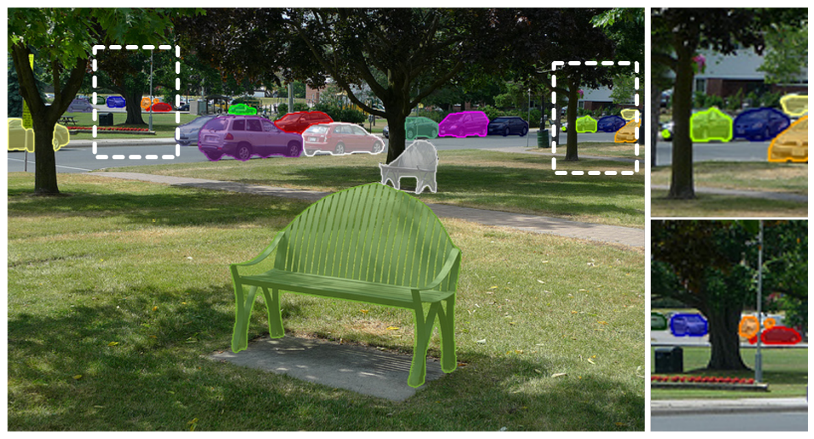
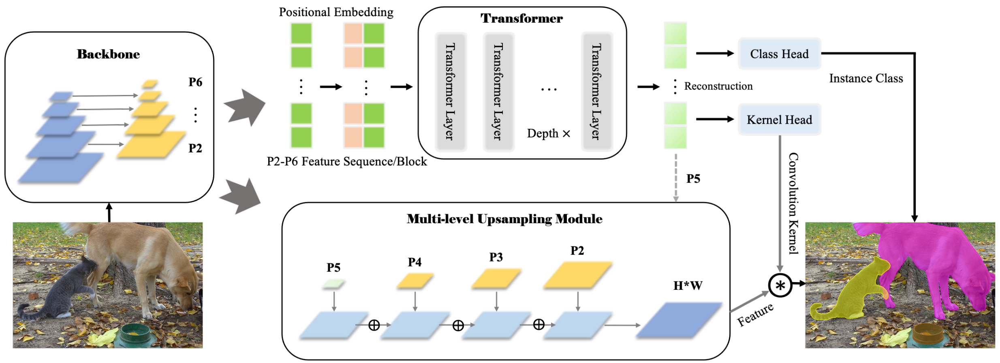
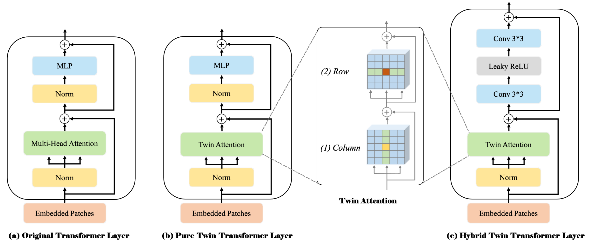
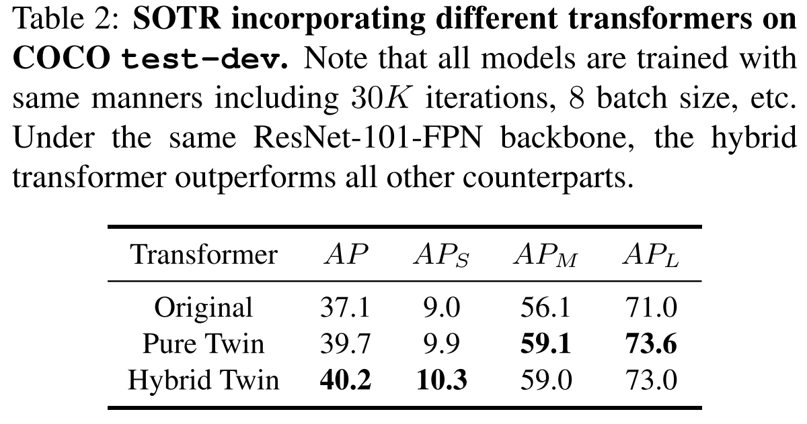
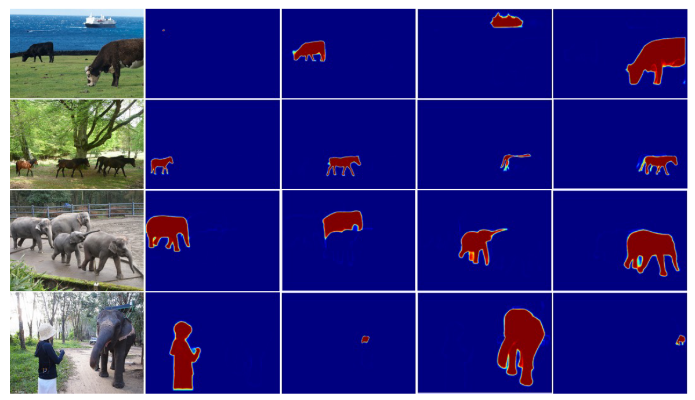
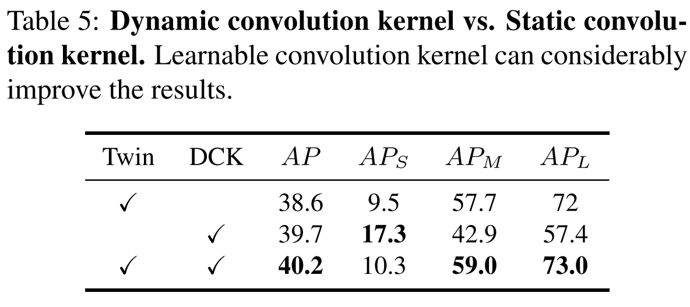
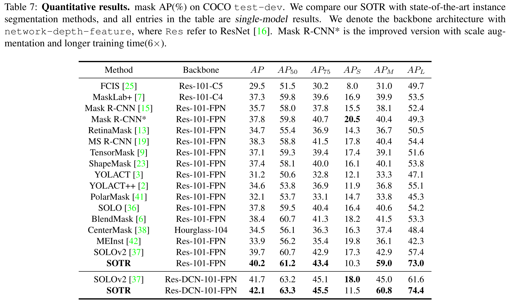

Paper: [ICCV 2021] SOTR: Segmenting Objects with Transformers

Arxiv: https://arxiv.org/abs/2108.06747

Github: https://github.com/easton-cau/SOTR

## 介绍
最近 tansformer-based 模型在视觉任务上表现出令人印象深刻的性能，甚至超过了卷积神经网络。在这项工作中，作者提出了一种新颖、灵活且有效的 tranformer-based 模型用于高质量的实例分割。所提出的模型，即 Segmenting Objects with TRansformers (SOTR)，简化了分割的pipeline，具有2个并行的子任务：（1）通过 transformer 预测每个实例类别，（2）使用多层级上采样模块动态生成 segmentation mask。SOTR 可以分别通过特征金字塔（FPN）和 twin transformer 有效地提取较低级别的特征表示（lower-level feature representations）并不惑远程上下文依赖关系（long-range context dependencies）。同时，与原始的 tranformer 相比，多提出的 twin transformer 在时间和资源上都是有效的，因为只涉及行和列注意力（a row and a column attention ）来编码像素。此外，SOTR 很容易与各种 CNN backbones 和 transformer 模型变体结合，从而显著提高分割精度和收敛性。
<!-- truncate -->

<!--  -->

*Figure 1. SOTR 选择的输出。大目标和具有复杂形状的目标都可以很好的被分割。*

现代实例分割方法通常建立在 CNN 之上并遵循先检测后分割范式，该范式由一个用于识别和定位所有目标的检测器和一个用于生成分割掩码的掩码分支组成。这这种分割方法的成功归功于以下优点，即平移和位置不变性（tanslation equivariance and location），但面临以下障碍：1）由于感受野受限，CNN 在高级视觉语义信息中相对缺少特征的连贯性（features' coherence）来关联实例，导致对大目标的次优结果；2）分割质量和推理速度都严重依赖目标检测器，在复杂场景中性能较差。

为了克服这些缺点，提出了一些 Bottom-up 的策略。Bottom-up 的方法的主要缺点是在不同场景的数据集上不稳定的聚类（例如，）和较差的泛化能力。SOTR有效学习了位置敏感特征和动态生成实例分割结果，不需要后处理聚合，不受限于边界框位置和尺寸。我们提出了一种创新的自下而上模型 SOTR，它巧妙地结合了 CNN 和 Transformer 的优势。

<!--  -->

*Figure 2. SOTR 框架。SOTR建立在简单的FPN主干之上，只进行了最少的修改。该模型将FPN特征P2-P6展平，并补充position embedding，再将它们输入到 Transformer 模型。在 Transformer 模型之后添加2个 head，用于预测目标类别并且生成动态卷积核（dynamic convolution kernels）。多级上采样模块将 FPN 的 P2-P5 特征和 transformer 的 P5 特征作为输入，在通过动态卷积操作生成最终的分割结果。*

<!--  -->

*Figure 3. 3种不同的 transformer 层设计。（a）原始是 transformer 编码器。为了更好的建模远程依赖并提高计算效率，我们引入不同的 transformer 层设计：（b）纯 twin transformer layer 和 （c）混合 twin transformer layer。这两种层都基于我们设计的 twin attention，依次由 column-attention 和 row-attention 组成。*

## 方法

### Transformer

**Twin attention.** self-attention 是 transformer 模型的关键组件，它内在地在输入序列上的每个元素之间捕获了全图的上下文信息并且学习到了长距离的交互。然而，self-attention 具有二次时间和内存复杂性，在高维维度序列（如图像）上产生更高的计算成本，并阻碍了不同设置下的模型可扩展性。

为了解决这个问题，本文提出了 twin attention 机制使用稀疏表示简化了注意力矩阵。这个策略主要将感受野限制为固定步幅的设计块模式。它首先计算每列内的注意力，同时保持不同列中的元素独立。该策略可以在水平尺度上聚合元素之间的上下文信息（如图3（1）所示）。然后，在每一行内执行类似的注意力，以充分利用垂直尺度的特征交互（如图3（2）所示）。两个尺度中的注意力一次连接到最后一个，它具有全局感受野，覆盖了两个维度上的信息。

FPN的第i层特征定义为 $F_i \in \mathbb{R}^{H \times W \times C}$，SOTR 首先将这个特征图切分成 ${N \ast N}$ 个 patches ${P_i \in \mathbb{R}^{N \times N \times C}}$ ，然后将它们沿垂直和水平方向堆叠成固定的 blocks。Position embeddings 被添加到这些 blocks 中以保留位置信息，这意味着列和行的 position embedding 空间是 $1 \ast N \ast C$ 和 $N \ast 1 \ast C$。两个注意力层都采用了 multi-head attention 机制。为了便于多层连接和后处理，在 twin attention 中所有子层都会产生 $N \times N \times C$ 的输出。Twin attention 机制可以有效地将内存和计算复杂度从标准的 $O((H \times W)^2)$ 降低到 $O(H \times W^2 + W \times H^2)$。

**Transformer Layer.** 在本节中，我们介绍3个不同的基于编码器的 transformer 层作为我们的基本构建块，如图3所示。原始的 transformer 层类似于 NLP 中使用的编码器，如图3a所示，它包括2个部分：1）经过 a layer normalization 后的 a multi-head self-attention 机制，以及 2）在 a layer normalization 之后的 a multi-layer perception。除此之外，使用残差连接来连接这两个部分。最后，可以得到一个多维序列特征作为这些 transformer 层的 K 个串联的输出，用于不同功能 heads 的后续预测。

为了在计算成本和特征提取效果之间做出最佳权衡，我们遵循原来的 Transformer 层设计，仅在纯 Twin Transformer 层中用 twin attention 代替 multi-head attention ，如图3b所示。为了进一步提升 twin tranformer 的性能，我们还设计了图 3c 所示的 hybrid twin transformer。它将两个 $3 \times 3$ 卷积层通过 Leaky ReLU 层连接到每个 twin attention 模块。 假设添加的卷积操作可以作为注意力机制的有效的补充，更好地捕获局部信息并增强特征表示。

**Functional heads.** 来自 transformer 模块的特征图被输入到不同的功能 heads 以进行后续预测。class head 包括 a single linear layer 来输出一个 $N \times N \times M$ 的分类结果，其中 $M$ 是类别的数量。由于每个 patch 只为中心落入这个 patch 的单个目标分配一个类别，如 YOLO，我们利用多级预测并在不同特征级别共享这些 heads，以进一步提高模型在不同尺度对象上的性能和效率。 Kernel head 也由 a linear layer 组成，与 class head 并行输出一个 ${N \times N \times D}$ 的张量用于后续的 mask 生成，其中张量表示具有D个参数的 $N \times N$ 个卷积核。在训练期间，Focal Loss 应用于分类，而对这些卷积核的所有监督都来自最终的 mask 损失。

### Mask
为 instance-aware 和 position-sensitive 分割构建 mask 特征表示，一种直接的方式是对不同尺度的特征图进行预测。但是，这会增加时间和资源。收 Panoptic FPN 的启发，我们呢设计了 multi-level upsampling 模块，将每个 FPN 层级和 transformer 的特征合并为统一的 mask 特征。首先，从 transformer 模块中获取具有位置信息的相对低分辨率特征图 P5，并与 FPN 中的 P2-P4 结合执行融合。对于每个尺度的特征图，执行 $3 \times 3$ Conv，Group Norm 和 ReLU 操作。然后 P3-P5 被双线性上采样 2x、4x、8x，分别为（H4，W4）分辨率。最后，将处理后的 P2-P5 相加后，执行逐点卷积和上采样以创建最终统一的 $H \times W$ 特征图。

对于实例掩膜预测，SOTR 通过对上述统一特征图执行动态卷积操作，为每个 patch 生成 mask。给定来自 kernel head 的预测卷积核 $k \in RN \times N \times D$，每个 kernel 负责对应的 patch 中实例 mask 的生成。具体操作可以表示如下：

$$
Z^{H \times W \times N^2} = F^{H \times W \times C} \ast K^{N \times N \times D}
$$

其中 $\ast$ 表示卷积操作，$Z$ 是最终生成的 mask，维度为 $H \times W \times N^2$。其中，$D$ 的取值取决于卷积核的形状，也就是说，D等于 $\lambda 2 C$，其中 $\lambda$ 的 kernel 大小。最终的实例分割 mask 可以由 Matrix NMS[37] 生成，每个 mask 由 Dice Loss 独立监督。

## 实验

<!--  -->

*Table 2. 对比不同 transformer 的结果。*

用于特征编码的 Transformer。我们用三种不同的 transformers 来衡量我们模型的性能。这些变体的结果如表 2 所示。我们提出的 pure and hybrid twin transformers 在所有指标上都大大超过了 original transformer，这意味着 twin transformer 架构不仅成功地捕获了垂直和水平维度上的远程依赖关系，而且是更适合与 CNN 主干结合来学习图像的特征和表示。对于 pure and twin transformers，后者效果更好。我们假设原因是 $3 \ast 3$ Conv 可以提取局部信息并改进特征表达以增强 twin transformer 的合理性。

<!--  -->

*Figure 4. SOTR 的表现。*

我们展示了掩码特征的可视化。对于每一行，左边是原始图片，右边是与其对应的 positional-sensitive mask。

<!--  -->

*Figure 5. 和其他方法实例分割结果细节对比。*

我们将我们方法的分割结果与 Mask R-CNN 、Blendmask 和 SOLOv2 进行比较。代码和训练好的模型由原作者提供。 所有模型都使用 ResNet-101-FPN 作为主干，并且基于 Pytorch 和 Detectron2。 我们的 Mask 质量更好。

<!--  -->

*Table 5. 动态卷积核 vs. 静态卷积核。可学习的卷积核可以显着改善结果。*

动态卷积。对于 mask 生成，我们有两种选择：以静态卷积方式直接输出实例 mask 或通过动态卷积操作连续分割对象。前者不需要额外的 functional head 来预测卷积核，而后者包括卷积核以在融合特征的帮助下生成最终 mask。 我们在表 5 中比较了这两种模式。如图所示，没有 twin transformer 的 SOTR 实现了 39.7% 的 AP，表明 twin transformer 带来了 0.5% 的增益。 此外，动态卷积策略可以将性能提高近 1.5% AP。 原因是：一方面，由于非线性，动态卷积显着提高了表示能力。另一方面，动态卷积比静态卷积有助于更好更快地收敛。

<!--  -->

*Table 7. 实验结果对比。*