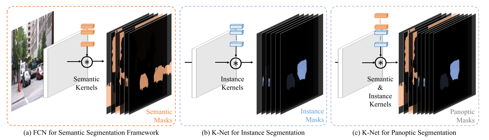
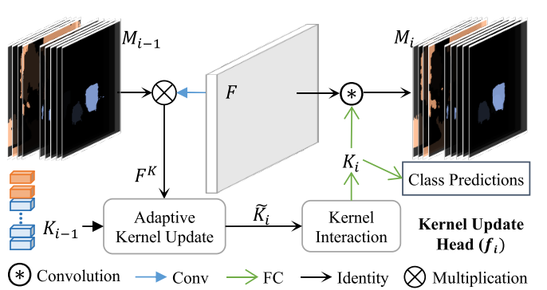
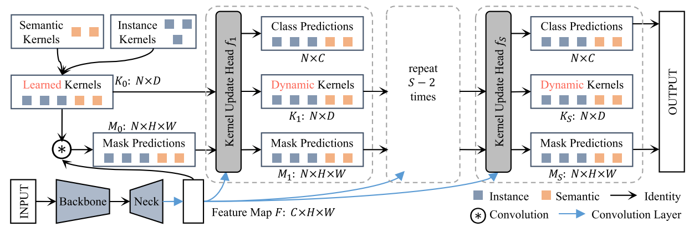
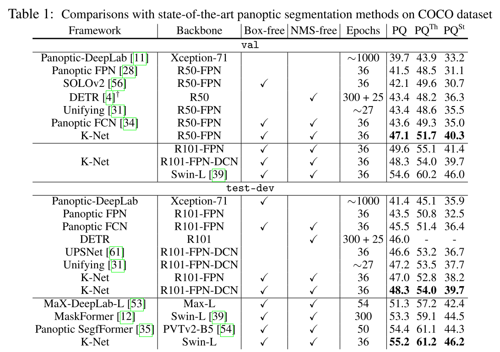
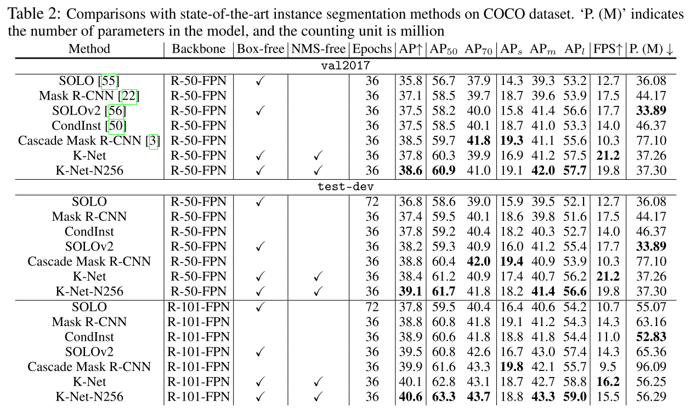
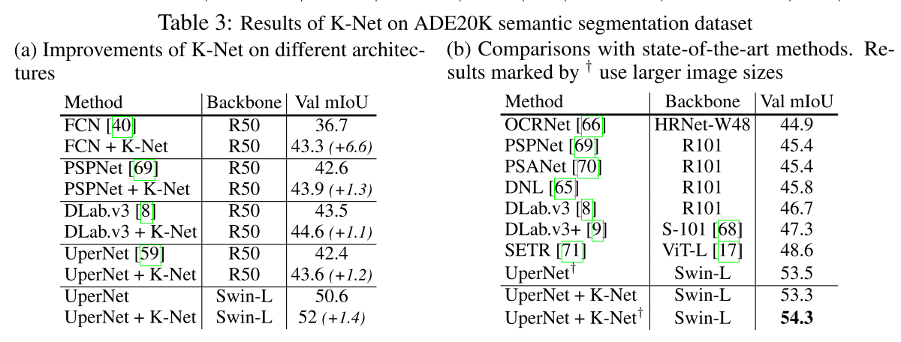
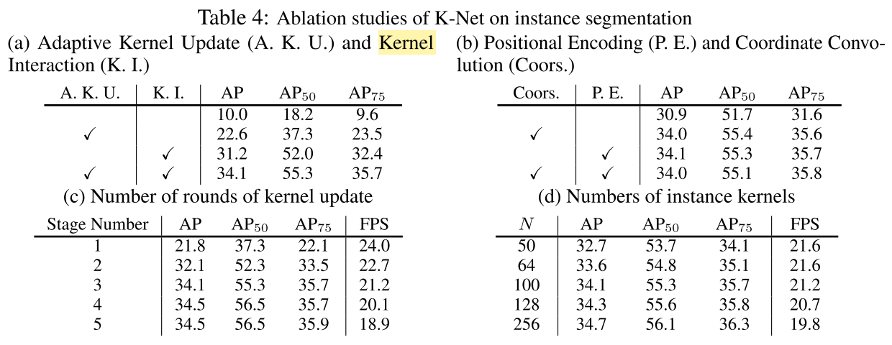
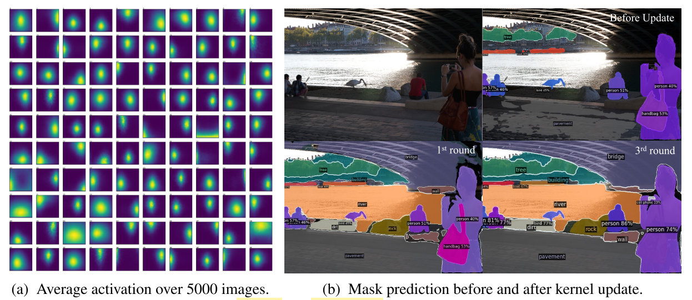

Paper: [NeurIPS 2021] K-Net: Towards Unified Image Segmentation

Arxiv: https://arxiv.org/abs/2106.14855

Github: https://github.com/ZwwWayne/K-Net/

## 介绍
语义、实例和全景分割之间尽管存在潜在联系，但是它们使用不同的和特定的框架来解决各自任务。这个工作为这些任务提供了一个统一、简单且有效的框架，即 K-Net。它通过一组可学习的 kernels 来分割实例和语义类别，其中每个 kernel 负责为潜在实例或 stuff 类别生成 mask。为了解决区分不同实例的困难，论文提出一种 kernel update 策略，改策略使每个 kernel 能够动态并以输入图像中意义组为条件。K-Net 可以通过二分匹配进行端到端的训练，其中训练和推理是不需要 NMS 和 矩形框的。

<!-- truncate -->

*Figure 1. 语义分割（a）、实例分割（b）、全景分割（c）任务在本论文中由一个通用框架统一起来*

在传统的语义分割中，每个 convolutinal kernel 对应一个语义类。我们的框架扩展了这个概念，是每个 kernel 对应一个潜在的实例或者一个语义类。

在本文中，我们首次尝试制定一个统一且有效的框架，通过 kernels 的概念来连接看似不同的图像分割任务（语义、实例和全景）。我们的方法被称为 K-Net（“K”代表内核）。它从一组随机初始化的卷积核开始，并根据现有的分割目标学习 kernels，即用于语义类别的 semantic kernels 和用于实例身份的 instance kernels（图1b)）。semantic kernels 和 instance kernels 的简单组合可以自然地进行全景分割（图1c)。在前向传递中，kernels 对图像特征进行卷积以获得相应的分割预测。

K-Net 的多功能性和简单性是通过两种设计实现的。首先，我们制定了 K-Net，以便它动态更新 kernels，使它们以它们在图像上的激活为条件。这种内容感知（content-aware）机制对于确保每个 kernel（尤其是 instance kernel）准确响应图像中的不同对象至关重要。通过迭代应用这种自适应 kernel 更新策略，K-Net 显着提高了 kernels 的判别能力并提升了最终的分割性能。值得注意的是，这种策略普遍适用于所有分割任务的 kernels 。

其次，受目标检测 DETR 最新进展的启发，我们采用二分匹配策略为每个内核分配学习目标。这种训练方法有利于传统的训练策略，因为它在图像中的 kernels 和实例之间建立了一对一的映射。因此，它解决了处理图像中不同数量的实例的问题。此外，它是纯 mask 驱动的，不涉及 boxes。因此，K-Net 自然是无 NMS 和无框的，这对实时应用很有吸引力。

## 方法

### K-Net
尽管“有意义的组”有不同的定义，但所有分割任务本质都将每个像素分配给一个预定义的有意义的组。由于通常假设图片中的组数是有限的，因此我们可以将分割任务的最大组设置为 N。例如，有 N 个预定义的语义类用于语义分割，或者图像中最多有 N 个目标用于实例分割。对于全景分割，N 是图像中 stuff 类和 objects 的总数。因此，我们可以使用 N 个内核将图像划分为 N 个组，其中每个 kernel 负责找到属于期对应组的像素。具体来说，给定由深度神经网络生成的 B 副图像的输入特征图 $F \in R^{B \times C \times H \times W}$，我们只需要 N 个内核 $K \in R^{N \times C}$ 与 $F$ 进行卷积即可获得相应的分割预测 $M \in R^{B \times N \times H \times W}$ 为

$$
M = \sigma (K \ast F)，
$$

其中 C，H 和 W 分别是特征图的通道数、高度和宽度。如果我们只想将每个像素分配给一个 kernel（通常用于语义分割），则激活函数 $\sigma$ 可以是 softmax 函数。如果我们允许一个像素属于多个 mask，则 Sigmoid 函数也可以用作激活函数，通过在激活图上设置一个阈值（如 0.5）（通常用于实例分割），这会产生 N 个二进制 masks。

这个公式已经主导了语义分割多年。在语义分割中，每个 kernel 负责在图像中找到相似类别的所有像素。而在实例分割中，每个像素组对应一个对象。然而，以前的方法通过额外的步骤而不是 kernel 来分离实例。

本文是第一个探讨语义分割中的 kernel 概念是否同样适用于实例分割，以及更普遍的全景分割的研究。为了通过内核分离实例，K-Net 中的每个内核最多只能分割图像中的一个对象（图 1b）。通过这种方式，K-Net 区分实例并同时进行分割，无需额外步骤即可一次性实现实例分割。为简单起见，我们在本文中将这些内核称为 semantic kernel 和 instance kernels，分别用于语义和实例分割。实例内核和语义内核的简单组合可以自然地执行全景分割，将像素分配给 an instance ID 或 a class of stuff（图1c)）。

### Group-Aware Kernels

尽管 K-Net 很简单，但直接通过内核分离实例并非易事。因为实例 kernels 需要区分图像内和图像间尺度和外观不同的 objects。没有像语义类别这样的共同和明确的特征，instance kernels 需要比 static kernels 更强的判别能力。

<!--  -->

*Figure 2. Kernel Update Head*

为了克服这一挑战，我们提供了一种方法，通过 kernel update head 使 kernel 以相应的像素组为条件，如图2所示。Kernel update head $f_i$ 包含三个关键步骤：组特征组装（group feture assembling）、自适应内核更新（adaptive kernel update），和内核交互（kernel interaction）。首先，使用 mask 预测 $M_{i-1}$ 组装每个像素组的 group feature $F^K$。由于是每个组的上下文将它们彼此区分开来，因此使用 $F^K$ 自适应地更新其对应的内核 $K_{i-1}$。之后，内核相互交互，对图像上下文进行全面建模。 最后，获得的 group-aware kernels $K_i$ 对特征图 $F$ 进行卷积以获得更准确的 mask 预测 $M_i$。 如图3所示，这个过程可以迭代地进行，因为更精细的分区通常会降低组特征中的噪声，从而产生更具辨别力的内核。这个过程被表述为

$$
K_i, M_i = f_i(M_{i-1},K_{i-1},F)。
$$

<!--  -->

*Figure 3. K-Net for panoptic segmentation.*

一组 learned kernels 首先与特征图 $F$ 进行卷积以预测 mask $M_0$。然后这个 kernel update head 将 mask 预测 $M_0$、learned kernels $K_0$ 和 特征图 $F$ 作为输入，并生成类预测、group-aware (dynamic) kenrels 和 mask 预测。生成的 mask 预测、dynamic kernels 和特征图 $F$ 被发送到下一个 kernel update head。迭代执行此过程以逐步细化 kernel 和 mask 预测。

值得注意的是，具有迭代细化的 kernel update head 是通用的，因为它不依赖于 kernel 的特性。因此，它不仅可以增强 instance kernels，还可以增强 semantic kernels。

## 实验
<!--  -->

*Table 1. 在COCO数据集上和SOTA全景分割方法进行比较*

<!--  -->

*Table 2. 在COCO数据集上和SOTA实例分割方法进行比较*

<!--  -->

*Table 3. 在ADE20K语义分割数据集上的结果*

<!--  -->

*Table 4. K-Net在实例分割任务上的消融实验*

表4a表明 adaptive kernel update 和 kernel interaction 是高性能的必要条件。从表4b中可以看出，positional information 是有益的，positional encoding 略好于 coordinate convolution。但是两者组合没有进一步提升性能，因此在此框架中进使用了 positional enconding。表4c表明 kernel update 的轮数在第4轮的时候，性能接近饱和。最后，在 instance kernels 的数量实验中，增加 N 的数量可以提升性能，但是当 N 较大时，提升幅度变缓。

#### 可视化分析

<!--  -->

*Figure 4. kernels 及其 masks 的可视化分析*

Kernels 的总体分布。我们通过分析 val split 中 5000 个图像中 100 个实例内核的掩码激活平均值，仔细分析了在 K-Net 中学习到的实例内核的属性。所有 masks 都调整大小以具有类似的 $200 \times 200$ 分辨率以进行分析。如图 4a 所示，学习到的 kernels 是有意义的。不同的 kernels 专注于图像的不同区域和不同大小的对象，而每个 kernel 关注图像中靠近位置的相似大小的对象。

通过 Kernel Update 优化的 Masks。我们进一步分析了如何通过图 4b 中的 kernel update 来改进 kernel 的 mask 预测。在这里，我们采用 K-Net 进行全景分割，以彻底分析语义和实例掩码。static kernels 生成的 masks 是不完整的，例如，河流和建筑物的掩码缺失。内核更新后，分割掩码完全覆盖了内容，尽管掩码的边界仍然不理想。更多内核更新后，边界得到了细化。内核更新后实例的分类置信度也会增加。

## 总结

本文探讨了可以在分割过程中学习分离实例的实例内核。因此，以前辅助实例分割的额外组件可以被实例内核替换，包括边界框、嵌入生成和手工制作的后处理，如 NMS、内核融合和像素分组。这种尝试首次允许通过统一的框架处理不同的图像分割任务。该框架被称为 K-Net，首先通过学习的静态内核将图像划分为不同的组，然后通过从划分组中组装的特征迭代地细化这些内核及其对图像的划分。K-Net 在全景和语义分割基准上获得了新的SOTA的单模型性能，并在最近的实例分割框架中以最快的推理速度超越了成熟的 Cascade Mask R-CNN。我们希望 K-Net 和分析能够为未来统一图像分割框架的研究铺平道路。