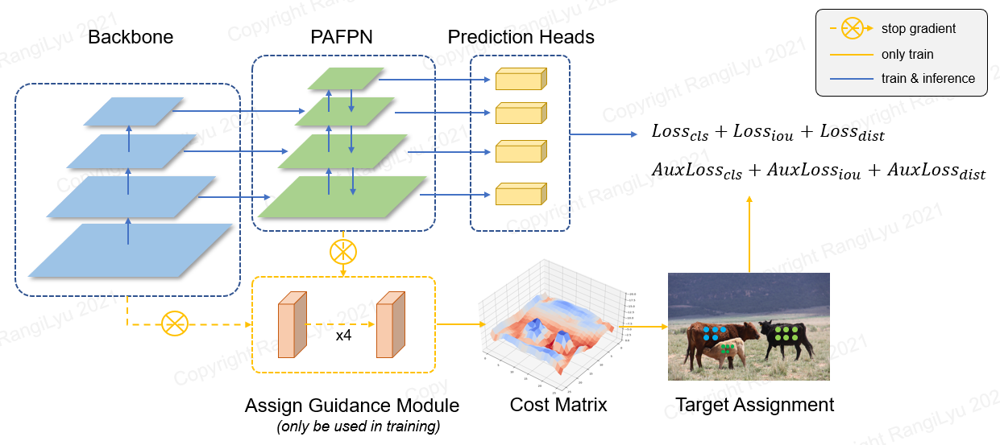
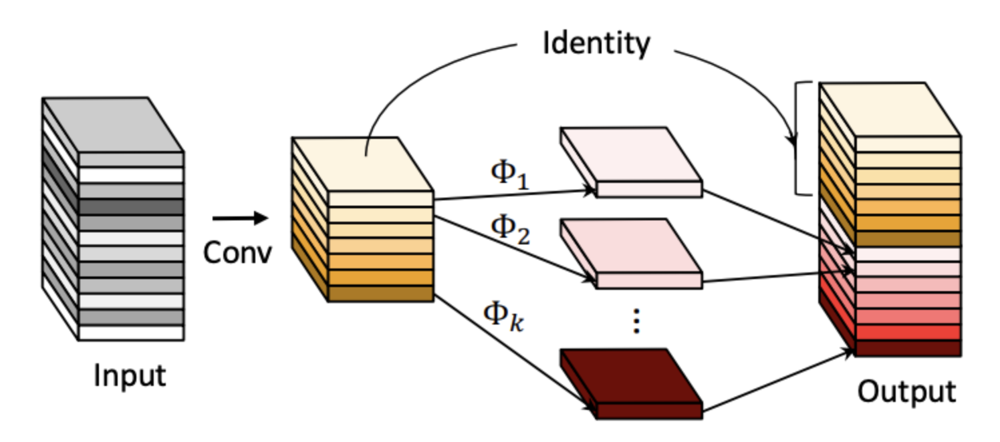
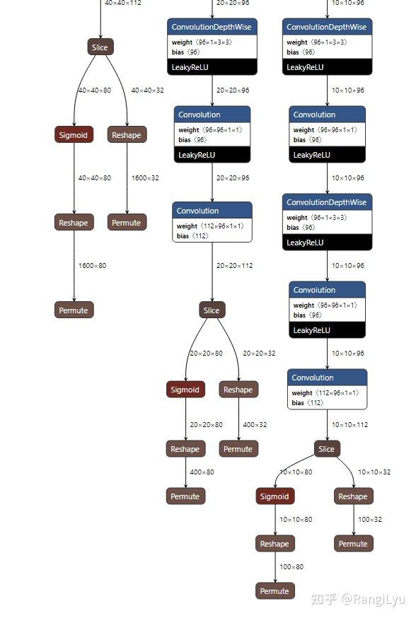
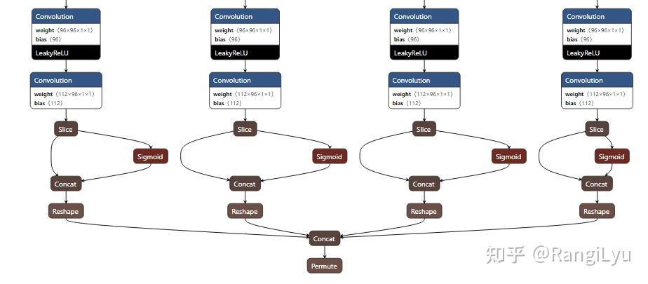
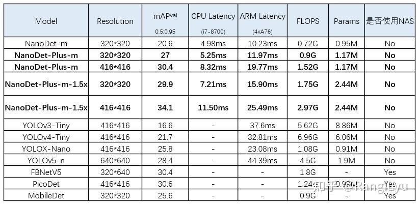

> Super fast and high accuracy lightweight anchor-free object detection model. Real-time on mobile devices.

Github link: [https://github.com/RangiLyu/nanodet](https://github.com/RangiLyu/nanodet)

<!-- truncate -->

## 1. Introduction

NanoDet, a high-performance and lightweight object detection model optimized for mobile devices, was open-sourced at the end of 2021. It quickly gained popularity, reaching 5.7k stars on GitHub. In response to the rise of competing lightweight models like YOLOX-Nano, FBNetV5, and PP-YOLO, NanoDet received upgrades in three key areas: **label assignment**, **multi-scale feature fusion**, and **training techniques**. These enhancements, now incorporated into NanoDet-Plus, achieve higher accuracy on the COCO dataset with real-time inference speeds on mobile.

In this article, I’ll introduce these improvements and their impact on NanoDet’s performance.

## 2. Label Assignment

Label Assignment is a crucial aspect of training object detection models. The earliest methods relied on position-based matching, evolving to anchor IOU-based matching, and more recently, to dynamic matching based on matching cost. Each of these advancements has driven substantial improvements in detection performance. In the previous version, NanoDet utilized ATSS (Adaptive Training Sample Selection) for label matching. Although ATSS dynamically selects samples on each feature map layer based on the mean and variance of IOU, it remains a static matching strategy grounded in prior information, such as anchor position and center.

Recent research has increasingly focused on global dynamic matching strategies. For instance, DETR utilizes the Hungarian matching algorithm for bilateral matching, OTA employs Sinkhorn iterations to solve optimal transport in matching, and YOLOX adopts SimOTA, an approximation of OTA. While these strategies have shown impressive results in large models, applying matching-cost-based dynamic matching to lightweight detection models introduces challenges not present in larger models.

### 2.1 Dynamic Matching 

Dynamic matching based on matching cost involves directly calculating the **matching cost** between the detection head’s output and each ground truth instance. This cost typically includes classification and regression losses. The result is an **NxM cost matrix**, where N represents the predicted points on the feature map and M represents all ground truths. Using this cost matrix, various dynamic matching strategies—such as Bipartite Graph Matching, Transmission Optimization, or Top-K selection—determine the optimal matches.

Unlike anchor-based matching, which **relies on static prior information** like IOU with anchors, this approach dynamically finds the best matches based on the current predictions. As the model’s predictions improve, the matching results are likely to be more accurate as well.

A natural question arises: if label assignment depends on predicted outputs, but those predictions rely on training through label assignment, how does the model learn effectively from a randomly initialized state? This can seem like a chicken-and-egg problem. However, due to the neural network’s inherent noise resilience, it can start training even from random initializations. As long as assigned points fall within the ground truth bounding boxes, the model begins to learn and fit the most easily detectable features.

For dense object detection models, unlike sparse predictors like DETR, dynamic matching strategies also use positional constraints to improve accuracy. For instance, OTA and SimOTA apply a 5x5 center region constraint to limit the degrees of freedom in matching, ensuring more stable learning.

#### 2.1.1 The Challenge of Dynamic Matching in Small Models

For small models, the detection head is significantly lighter. In NanoDet, only two Depthwise Separable Convolutional modules are used to predict classification and regression simultaneously. This is in stark contrast to large models, which often use four groups of 3x3 convolutions with 256 channels dedicated separately to classification and regression. Calculating Matching Cost from a randomly initialized state for such a lightweight detection head presents a considerable challenge.

### 2.2 Training Auxiliary Modules in NanoDet-Plus

NanoDet-Plus introduces a simpler and more lightweight training auxiliary module, the **Assign Guidance Module (AGM)**, paired with a **Dynamic Soft Label Assigner (DSLA)** strategy. Together, these components address the optimal label matching problem specifically for lightweight models. The architecture of NanoDet-Plus is shown below:

The Assign Guidance Module (AGM) consists of four 3x3 convolutions with a GN (Group Normalization) layer and shares parameters across feature maps at different scales, similar to the detection heads in large models. With parameter sharing and the absence of Depthwise Separable Convolutions (which are less GPU-friendly), AGM requires minimal training resources. Additionally, AGM is used only during training and is discarded afterward, so it has no impact on inference speed.

The classification scores and bounding boxes predicted by AGM are fed into the Dynamic Soft Label Assigner (DSLA) to calculate the **Matching Cost**. This cost function comprises three components: classification cost, regression cost, and distance cost.

$$
C_{cls} = CE(P, Y_{soft}) \times (Y_{soft}-P)^2
$$

$$
C_{reg} = -log(IOU)
$$

$$
C_{dis} = \alpha^{|x_{pred} - x_{gt}|-\beta}
$$

The final cost function is defined as: $ C = C_{cls} + \lambda C_{reg} + C_{dis} $, where the distance cost  $ C_{dis} $  is optional. Including  $ C_{dis} $  can accelerate AGM’s convergence in the early training stages, which is particularly useful for fine-tuning scenarios. Integrating AGM and DSLA in the previous NanoDet version achieved a 2.1 mAP improvement on the COCO dataset.

| Method| mAP 0.5:0.95 |
|:---:|:---:|
| NanoDet | 20.6|
| NanoDet + DSLA | 21.9|
| NanoDet + DSLA + AGM | 22.7|

## 3. Model Structure Improvement

In last version of NanoDet, shufflenet v2 is used as backbone, with PAFPN (without convolution) as Neck. Two group of Depthwise Separable Convolutions as detection head, which merged clssification and regression. For limitting the size of parameters is in 1M, all convolutions in neck are removed, which are more radical, and degrade the ability of multi-scale feature fusion.

In the previous version of NanoDet, ShuffleNet v2 was used as the backbone, paired with a convolution-free PAFPN as the neck. The detection head merged classification and regression branches using only two groups of Depthwise Separable Convolutions. Reflecting on this design, the decision to remove all convolutions from the neck to limit the model’s parameter size to under 1M was perhaps too aggressive, as it reduced the effectiveness of multi-scale feature fusion.

### 3.1 Feature Fusion Improvements

Some lightweight models, like YOLOX, PicoDet, and YOLOv5, utilize **CSP-PAN** as their feature pyramid module. In NanoDet-Plus, **Ghost-PAN**, an optimized version of PAN, leverages the GhostBlock from GhostNet for efficient feature fusion across multiple layers. Its core unit consists of **a 1x1 convolution and a 3x3 depthwise convolution**, keeping both parameter count and computation low.

With only 190k parameters, Ghost-PAN adds approximately 1ms to the running time on ARM devices, with even less impact on x86 and GPU. Despite its compact size, Ghost-PAN achieves a notable performance boost, improving mAP by 2%.

### 3.2 Improvement of the Detection Head

The ThunderNet paper proposed that, in lightweight models, changing the depthwise component of depthwise separable convolution from 3x3 to 5x5 can improve the detector’s receptive field and performance with minimal parameter increase. This technique has now become common in lightweight models, so NanoDet-Plus has also adopted a 5x5 kernel size for the depthwise convolutions in the detection head.

Additionally, PicoDet introduced an extra downsampling layer to enhance the original 3-layer feature structure used in NanoDet. To achieve comparable performance, NanoDet-Plus has incorporated this improvement, resulting in an approximate 0.7 mAP increase.

## 4. Training Trick Improvement

As an open-source project, NanoDet aims to be user-friendly and accessible, rather than solely focused on maximizing performance metrics. The previous generation of NanoDet used the traditional SGD with momentum and MultiStepLR for training. While this approach is effective for experienced practitioners who can leverage large learning rates and gradual decay, it poses challenges for newcomers who may struggle with model convergence.

To improve the user experience, NanoDet-Plus has made comprehensive updates to its training strategy:

- Optimizer: Changed from SGD with momentum to AdamW, which is less sensitive to hyperparameters and offers faster convergence.
- Learning Rate Schedule: Switched from MultiStepLR to CosineAnnealingLR for smoother learning rate decay.
- Gradient Clipping: Added during backpropagation to prevent NaN losses caused by unoptimized parameter settings.
- Exponential Moving Average (EMA): Incorporated the popular model-smoothing strategy for further stability.

These adjustments make NanoDet-Plus easier to train effectively, even for users without extensive tuning experience.

Here’s a refined and clear version of the “Deployment Optimization” section:

## 5. Deployment Optimization

In the previous generation of NanoDet, the multi-scale detection head produced six outputs: classification and regression outputs for each of the three feature map scales. This setup was challenging for users unfamiliar with the model structure.

To make the model more accessible, NanoDet-Plus has **reduced the number of outputs to just one**. All output tensors are pre-reshaped and concatenated into a single tensor. While this approach introduces a few additional operations, causing a slight slowdown in post-processing speed, it is far easier for users who may not fully understand the model’s architecture. For advanced users well-versed in model structure, using the original output configuration should still be manageable if they wish to optimize further.

Following these output adjustments, consistent updates were made across the C++ code for deployment backends, including ncnn, MNN, OpenVINO, and the Android Demo. The post-processing code and interfaces are now standardized across these platforms, so understanding one implementation enables understanding the others.

## 6. Conclusion

NanoDet-Plus addresses the limitations of the previous generation in areas such as label assignment, model structure, and training strategy. With the introduction of modules like **AGM**, **DSLA**, and **Ghost-PAN**, alongside comprehensive improvements in training strategy, NanoDet-Plus is now even easier to train. Deployment has also been optimized with a simplified output structure, making it more accessible. Detailed demos and guides are provided for ncnn, MNN, OpenVINO, and Android, helping users get started quickly.

Below is a comparison of NanoDet-Plus with other models:

