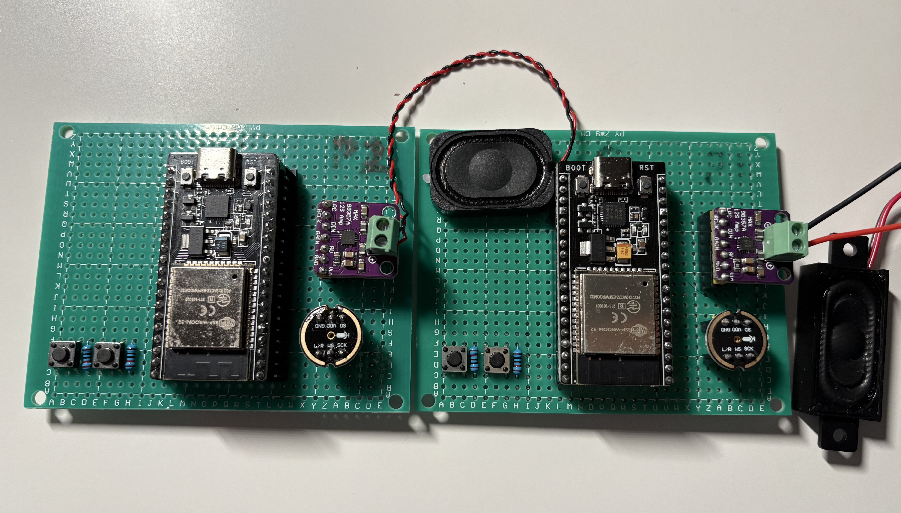

# Project Name: **EchoLink Mini**

---

# DIY ESP32 Walkie-Talkie with I2S Audio and ESP-NOW — *"EchoLink Mini"*

If you've ever dreamed of building a digital walkie-talkie from scratch, one that works without the internet, routers, or cellular networks, you're in the right place. Introducing **EchoLink Mini**, a compact, low-latency wireless voice communicator powered by ESP32, I2S audio components, and ESP-NOW.

<!-- truncate -->



## 🎯 What Is EchoLink Mini?

EchoLink Mini is a fully DIY digital walkie-talkie built using two ESP32 boards. It uses MEMS digital microphones (INMP441), I2S audio playback modules (MAX98357), and ESP-NOW for wireless communication — no Wi-Fi or Bluetooth pairing required.

It supports:

* Real-time half-duplex voice transmission
* Push-to-talk (PTT) operation
* µ-Law audio compression
* Low latency (\~150ms end-to-end)
* Compact design, battery operated

## 🧩 Hardware List

Each EchoLink Mini unit contains:

* ESP32 DevKit board
* INMP441 I2S microphone
* MAX98357 I2S DAC amplifier
* 3W 4Ω speaker
* Push-to-talk button (GPIO)
* 18650 battery + TP4056 charger + boost converter (5V)
* Optional: OLED screen, SD card, volume knob

## 🛠️ Core Technologies

### 1. **I2S Audio Chain**

* **Recording**: INMP441 captures 16-bit mono PCM audio at 16kHz via I2S0
* **Playback**: MAX98357 outputs decoded audio via I2S1
* **Compression**: µ-Law encoding (G.711) to reduce bandwidth to 8kHz, 8-bit

### 2. **ESP-NOW Wireless**

ESP-NOW is a fast, connectionless protocol built on Wi-Fi that allows peer-to-peer communication without a router. It’s perfect for short audio packets (e.g. 200 bytes every 25ms).

### 3. **FreeRTOS Tasks**

* `micTask()`: samples audio, compresses, sends
* `speakerTask()`: receives, decompresses, plays
* Circular buffers and task queues keep the latency low and jitter minimal

## 🔋 Power Supply

EchoLink Mini is designed to run portably using a single 18650 Li-ion battery. The TP4056 manages charging and protection, while a boost converter supplies stable 5V to the ESP32 and audio modules.

## 🧠 Why µ-Law?

Using µ-Law encoding reduces audio data to 1/4th its size with minimal perceptual loss. It enables the system to run full-duplex audio within the ESP-NOW data limit (250 bytes max).

## 🗨️ Use Cases

* Team intercom in workshops or maker labs
* Classroom or training room assistant
* Walkie-talkie for hiking trips (no cellular coverage)
* Experimental voice IoT

## 🌱 Possible Extensions

* Add OLED for UI (channel, battery)
* Volume control via potentiometer
* VOX (voice-activated transmit)
* Multi-channel pairing or ID broadcast
* Encryption (ESP-NOW supports PMK)
* Replace µ-Law with Opus for better quality

## 📦 Source Code

The full open-source Arduino code is available on [GitHub](https://github.com/xingkongliang/echolink-mini) with PlatformIO support.

## 🎉 Final Thoughts

**EchoLink Mini** is not just a walkie-talkie — it's a proof of concept for low-power, real-time audio communication using ESP32s without relying on traditional wireless infrastructure.

Whether you're building it for fun, education, or as a foundation for something bigger, it's a rewarding and surprisingly high-performance project.

Let your voice be heard — wirelessly, efficiently, and entirely offline.

---

🛠️ *Built with love, one packet at a time.*


```cpp
/*
 * ESP32 Walkie‑Talkie (Half‑Duplex)
 * -------------------------------------------------------------
 * Hardware
 *   – ESP32‑DevKit (two identical nodes)
 *   – INMP441 I2S MEMS microphone
 *   – MAX98357A I2S DAC/amp + 3 W speaker
 *   – Push‑to‑talk switch on GPIO0 (active LOW)
 *   – Optional micro‑SD (for debug recordings)
 *
 * Network layer
 *   ESP‑NOW (fast, connection‑less, ≤ 250 B payload)
 *   Both nodes run identical firmware. At first start each node
 *   prints its Wi‑Fi MAC in the serial console (115200 baud). Put
 *   the peer’s MAC into PEER_MAC below and re‑flash.
 *
 * Audio layer
 *   – 16 kHz, 16‑bit, mono PCM from mic (I2S0 in RX‑only mode)
 *   – µ‑Law companding to 8 kHz, 8‑bit (4× compression)
 *   – Packet = 200 bytes payload → 25 ms of audio → 40 packets s‑1
 *   – Jitter buffer 4 packets (≈ 100 ms) on receive side
 *
 * Build
 *   PlatformIO / VS Code, env = esp32dev, Arduino framework.
 *   Serial monitor @ 115200.
 * -------------------------------------------------------------*/

#include <Arduino.h>
#include <esp_now.h>
#include <WiFi.h>
#include <driver/i2s.h>
#include <esp_wifi.h>

//--------------------------------------------------
// ----------   PIN ASSIGNMENTS   ------------------
//--------------------------------------------------
// SD Card (optional)
#define SD_CS          5
#define SPI_MOSI      23
#define SPI_MISO      19
#define SPI_SCK       18

// Speaker I2S (MAX98357)
#define I2S_DOUT      27   // DATA out to DAC
#define I2S_BCLK      26   // Bit‑clock
#define I2S_LRC       25   // Word‑select / LRCLK

// Mic I2S (INMP441) – fixed pins, do not swap
#define MIC_WS        14   // Word‑select
#define MIC_SD        33   // Data OUT from mic → ESP32 IN
#define MIC_SCK       32   // Bit‑clock

#define PTT_PIN       23   // Push‑to‑talk (active LOW)

//--------------------------------------------------
// ----------   AUDIO PARAMETERS   -----------------
//--------------------------------------------------
static constexpr uint32_t SAMPLE_RATE_HZ  = 16000;   // PCM input
static constexpr size_t   PCM_SAMPLES_PKT = 400;     // 25 ms @ 16 kHz
static constexpr size_t   MULAW_PKT       = 200;     // µ‑Law 8 kHz

//--------------------------------------------------
// ----------   ESP‑NOW CONFIG   -------------------
//--------------------------------------------------
// Put the peer’s base‑10 MAC bytes here before flashing.
// P1 MAC = A0:A3:B3:2C:B9:94
// P2 MAC: CC:DB:A7:2F:48:D8
uint8_t PEER_MAC[6] = {0xA0, 0xA3, 0xB3, 0x2C, 0xB9, 0x94};   // P1 MAC
// uint8_t PEER_MAC[6] = {0xCC, 0xDB, 0xA7, 0x2F, 0x48, 0xD8};   //P2 MAC 

// A queue feeding speaker (PCM16)
static QueueHandle_t spkQueue;

//--------------------------------------------------
// ----------   µ‑Law CODEC ------------------------
//--------------------------------------------------
// Basic ITU‑T G.711 µ‑Law implementations (lookup tables).
static inline uint8_t linearToMuLaw(int16_t pcm)
{
    const uint16_t MULAW_MAX = 0x1FFF;    // 8191
    const uint8_t  MULAW_BIAS = 33;

    uint16_t mask;
    uint16_t seg;
    uint8_t  uval;

    pcm = pcm >> 2;                      // 14‑bit dynamic range
    mask = (pcm < 0) ? 0x7F : 0xFF;
    if (pcm < 0) pcm = -pcm;
    if (pcm > MULAW_MAX) pcm = MULAW_MAX;
    pcm += MULAW_BIAS;

    /* Convert the scaled magnitude to segment number. */
    seg = 0;
    uint16_t temp = pcm;
    for (seg = 0; seg < 8; seg++) {
        if (temp <= 0x1F) break;
        temp >>= 1;
    }

    /* Combine the sign, segment, and quantization bits. */
    uval = (~((seg << 4) | ((pcm >> (seg + 1)) & 0xF))) & mask;
    return uval;
}

static inline int16_t muLawToLinear(uint8_t u_val)
{
    const int16_t exp_lut[8] = {0, 132, 396, 924, 1980, 4092, 8316, 16764};

    u_val = ~u_val;
    int16_t t = ((u_val & 0xF) << 3) + 132;
    t <<= ((unsigned)u_val & 0x70) >> 4;
    return (u_val & 0x80) ? (132 - t) : (t - 132);
}

//--------------------------------------------------
// ----------   I2S INITIALISATION -----------------
//--------------------------------------------------
static void initMic()
{
    i2s_config_t micCfg = {
        .mode = (i2s_mode_t)(I2S_MODE_MASTER | I2S_MODE_RX),
        .sample_rate = SAMPLE_RATE_HZ,
        .bits_per_sample = I2S_BITS_PER_SAMPLE_16BIT,
        .channel_format = I2S_CHANNEL_FMT_ONLY_LEFT,
        .communication_format = I2S_COMM_FORMAT_STAND_I2S,
        .intr_alloc_flags = ESP_INTR_FLAG_LEVEL1,
        .dma_buf_count = 4,
        .dma_buf_len = PCM_SAMPLES_PKT,
        .use_apll = false,
        .tx_desc_auto_clear = false,
        .fixed_mclk = 0
    };

    i2s_pin_config_t micPins = {
        .bck_io_num   = MIC_SCK,
        .ws_io_num    = MIC_WS,
        .data_out_num = -1,
        .data_in_num  = MIC_SD
    };

    i2s_driver_install(I2S_NUM_0, &micCfg, 0, nullptr);
    i2s_set_pin   (I2S_NUM_0, &micPins);
}

static void initSpeaker()
{
    i2s_config_t spkCfg = {
        .mode = (i2s_mode_t)(I2S_MODE_MASTER | I2S_MODE_TX),
        .sample_rate = SAMPLE_RATE_HZ,
        .bits_per_sample = I2S_BITS_PER_SAMPLE_16BIT,
        .channel_format = I2S_CHANNEL_FMT_ONLY_LEFT,
        .communication_format = I2S_COMM_FORMAT_I2S_MSB,
        .intr_alloc_flags = ESP_INTR_FLAG_LEVEL1,
        .dma_buf_count = 4,
        .dma_buf_len = PCM_SAMPLES_PKT,
        .use_apll = false,
        .tx_desc_auto_clear = true,
        .fixed_mclk = 0
    };

    i2s_pin_config_t spkPins = {
        .bck_io_num   = I2S_BCLK,
        .ws_io_num    = I2S_LRC,
        .data_out_num = I2S_DOUT,
        .data_in_num  = -1
    };

    i2s_driver_install(I2S_NUM_1, &spkCfg, 0, nullptr);
    i2s_set_pin   (I2S_NUM_1, &spkPins);
}

//--------------------------------------------------
// ----------   ESP‑NOW CALLBACKS ------------------
//--------------------------------------------------
static void onDataRecv(const uint8_t *mac, const uint8_t *incomingData, int len)
{
    // Each byte is µ‑Law, 25 ms frame.
    static int16_t pcmBuf[PCM_SAMPLES_PKT];
    if (len != MULAW_PKT) return;  // sanity check

    for (int i = 0; i < MULAW_PKT; ++i)
        pcmBuf[i] = muLawToLinear(incomingData[i]);

    // Push to speaker queue (ISR‑safe version)
    if (xQueueSendFromISR(spkQueue, pcmBuf, nullptr) != pdTRUE) {
        // queue full → drop
    }
}

//--------------------------------------------------
// ----------   TASKS ------------------------------
//--------------------------------------------------
void micTask(void *pv)
{
    static int16_t pcm[PCM_SAMPLES_PKT];
    static uint8_t ulaw[MULAW_PKT];

    size_t bytesRead;
    while (true) {
        // Wait until PTT pressed (LOW)
        if (digitalRead(PTT_PIN) == LOW) {
            i2s_read(I2S_NUM_0, pcm, sizeof(pcm), &bytesRead, portMAX_DELAY);
            if (bytesRead != sizeof(pcm)) continue;

            // Downsample 16 kHz→8 kHz: drop every other sample
            for (size_t i = 0, j = 0; i < PCM_SAMPLES_PKT; i += 2, ++j) {
                int16_t s = pcm[i];
                ulaw[j] = linearToMuLaw(s);
            }

            esp_now_send(PEER_MAC, ulaw, sizeof(ulaw));
        } else {
            vTaskDelay(pdMS_TO_TICKS(10));
        }
    }
}

void speakerTask(void *pv)
{
    static int16_t pcm[PCM_SAMPLES_PKT];
    size_t bytesWritten;

    while (true) {
        if (xQueueReceive(spkQueue, pcm, portMAX_DELAY) == pdTRUE) {
            // Duplicate samples to restore 8→16 kHz (naïve interp.)
            static int16_t up[PCM_SAMPLES_PKT];
            for (int i = 0; i < MULAW_PKT; ++i) {
                up[i * 2] = pcm[i * 1];
                up[i * 2 + 1] = pcm[i * 1];
            }
            i2s_write(I2S_NUM_1, up, sizeof(up), &bytesWritten, portMAX_DELAY);
        }
    }
}

//--------------------------------------------------
// ----------   SETUP ------------------------------
//--------------------------------------------------
void setup()
{
    Serial.begin(115200);
    delay(1000);

    pinMode(PTT_PIN, INPUT_PULLUP);

    // Print MAC so user can copy to peer
    Serial.print("My MAC: "); Serial.println(WiFi.macAddress());

    WiFi.mode(WIFI_STA);
    esp_wifi_set_ps(WIFI_PS_NONE); // disable power‑save for latency

    if (esp_now_init() != ESP_OK) {
        Serial.println("ESP‑NOW init failed");
        ESP.restart();
    }

    esp_now_register_recv_cb(onDataRecv);

    esp_now_peer_info_t peer{};
    memcpy(peer.peer_addr, PEER_MAC, 6);
    peer.channel = 0;  // same channel
    peer.encrypt = false;
    if (esp_now_add_peer(&peer) != ESP_OK) {
        Serial.println("Failed to add peer");
    }

    initMic();
    initSpeaker();

    spkQueue = xQueueCreate(8, sizeof(int16_t) * PCM_SAMPLES_PKT);

    xTaskCreatePinnedToCore(micTask,     "mic",     4096, nullptr, 1, nullptr, 0);
    xTaskCreatePinnedToCore(speakerTask, "speaker", 4096, nullptr, 1, nullptr, 1);

    Serial.println("Walkie‑talkie ready. Hold PTT (GPIO0) to talk.");
}

void loop()
{
    vTaskDelay(pdMS_TO_TICKS(1000));
}

```
